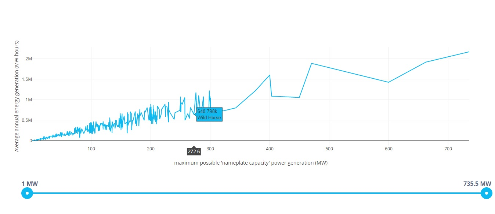
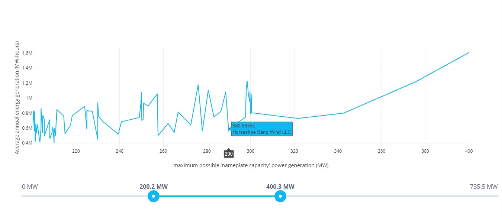

# Windfarms

We have a hypothesis that larger wind farms tend to be less efficient, since they experience higher "wake loss" (larger farms have more rows of turbines that obstruct the wind for each downwind turbine).

This is an interactive web application that might help test this hypothesis.

This is a screenshot of the chart: 

 *(every point has its marker)*

The slider can be used to update the values in the chart to display the data more in detail: 

 *(e.g. between 200 and 400 MW)*

## Instructions
In the project folder, run `npm install` to install the necessary modules. 
Then run `ng serve` for a dev server. Navigate to `http://localhost:4200/`.  
The app will automatically reload if you change any of the source files.

## Build

Run `ng build` to build the project. The build artifacts will be stored in the `dist/` directory. Use the `--prod` flag for a production build.

  
This project was generated with [Angular CLI](https://github.com/angular/angular-cli) version 7.3.5.
