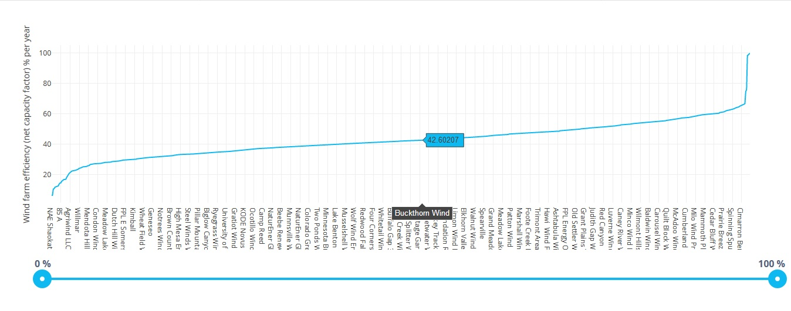
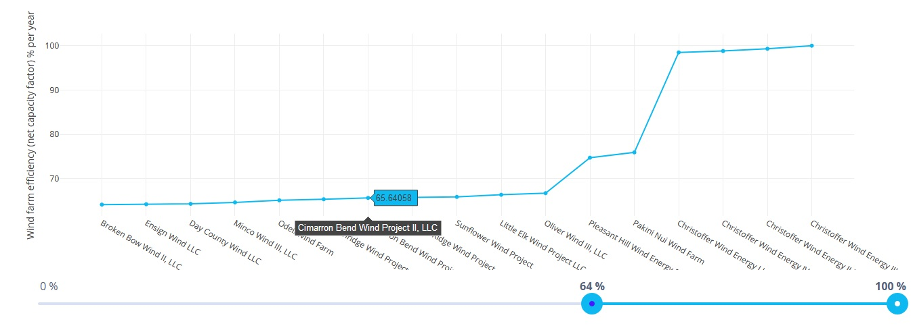

# Windfarms

We have a hypothesis that larger wind farms tend to be less efficient, since they experience higher "wake loss" (larger farms have more rows of turbines that obstruct the wind for each downwind turbine).

A wind farm's efficiency is defined by its 'net capacity factor', which is:

    generation / (capacity * time)

*(in this case, time is 1 year or 8760 hours)*

This is an interactive web application that might help test this hypothesis.

This is a screenshot of the chart: 

 

The slider can be used to update the values in the chart to display the data more in detail: 

 *(e.g. between 64% and 100% efficiency)*

## Instructions
In the project folder, run `npm install` to install the necessary modules. 
Then run `ng serve` for a dev server. Navigate to `http://localhost:4200/`.  
The app will automatically reload if you change any of the source files.

  
This project was generated with [Angular CLI](https://github.com/angular/angular-cli) version 7.3.5.
